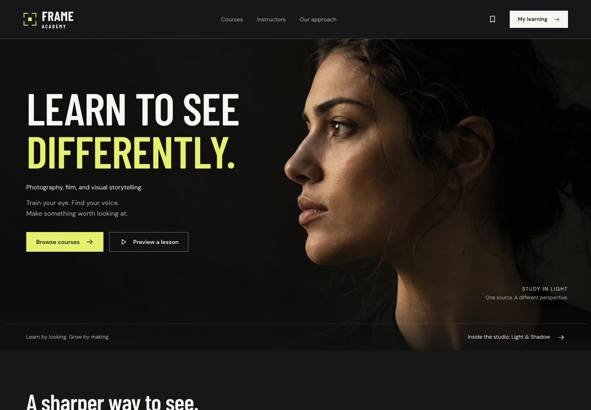

# FRAME ACADEMY

A complete fictional course academy for photography, film and visual storytelling. Built as a self-initiated agency portfolio demonstration with Next.js static export and browser-only learner records. **No database, backend application, external account, payment provider or service key is required.**



## Run it

Prerequisites: Node.js 22.18 or later and npm. Verified here with Node 26.0.0 / npm 11.12.1. Dependencies install from npm; generated images, fonts, lessons and videos are already included. Google Chrome is needed only for the provided browser/media-rendering scripts.

```sh
npm ci
npm run dev
```

Development preview: `http://127.0.0.1:3000` (Next may choose another port if occupied).

```sh
npm run typecheck
npm run lint
npm test
npm run build
npm run verify:export
PORT=4173 npm run start
```

Production static preview: `http://127.0.0.1:4173`. `npm run start` without `PORT` uses 3000. The server only serves the exported `out/` files, with directory routing, byte-range video requests and a 404 page. It is not an application backend. Keep that server running while testing:

```sh
npm run test:browser
npm run test:finish
```

For another preview port, run `PREVIEW_URL=http://127.0.0.1:PORT npm run test:browser` with the actual port. The focused finish script rechecks profile-name validation, certificate downloads/print output, fullscreen, and the matched quiz captures. Chrome is selected through Playwright’s `chrome` channel. No browser installation or registration is needed by a visitor to the finished static site.

## What is implemented

- Cinematic original photography, six distinct covers, three fictional instructor portraits, local Barlow Condensed/DM Sans fonts, frame mark and favicon.
- Six course detail pages, searchable/filterable/sortable catalog with public URL state, saved courses and three instructor profiles.
- Eighteen lessons: six genuine 60-second H.264 visual clips, six 350–650 word illustrated readings and six guided practices. Six five-question quizzes; six worksheets, transcripts and caption files.
- Local enrollment with stable receipts and original USD price snapshots; duplicate enrollment reuses access. No credentials or payment fields.
- Native video controls, speed and text-caption preferences, real transcript/bookmark seeking, saved playheads, explicit completion and consistent resume rules.
- Plain-text notes with editing/deletion, course/lesson filters and Markdown export. Private practice checklists and saved reflections.
- Dashboard, profile, saved courses, certificates, help, local support form/viewer, deliberate demo scenarios and scoped resets.
- Real on-demand 1800 × 1200 certificate PNG export and a one-page print view. Existing certificates preserve their name/date snapshots.
- Forty-nine required exported routes, seven 1200 × 630 social covers, static metadata and noindex/follow policy. No deployment is claimed.

## Five-minute walkthrough

1. Open Courses. Filter Photography / Beginner, save Light & Shadow, then open its detail page.
2. Watch the free visual lesson. Review its transcript and click a timestamp.
3. Choose Enroll in demo. Use a sample name and inspect the local confirmation receipt.
4. In the player, save a timestamped note and bookmark. Pause, leave and resume. Mark the video and reading complete.
5. Complete the practice checklist and submit a reflection of at least 20 characters. Your files stay on your device.
6. Fail or pass the final quiz, review explanations and retry. At least 4/5 is a pass; a later lower result preserves the achievement.
7. When all three lessons and the quiz are complete, download the demo certificate. Use My Learning to review or deliberately reset the course.

For a faster tour, `/demo/` offers confirmed Fresh, In-progress and Completed-course scenarios. Nothing overwrites visitor records on initial load.

## Local data and honest limits

The single namespaced envelope is `frame-academy:demo:v1` in localStorage. It holds a sample profile, enrollments, saved IDs, lesson progress/reflections, quiz drafts/attempts, notes, bookmarks, certificates and local support requests. No binary media, passwords, tokens or payment details are stored there.

Data belongs to the current browser profile and site origin. A change of port/domain/browser/device means different storage. It can be edited or cleared and does not sync. Storage failures preserve the last committed snapshot; an explicit temporary memory session lets you retry without claiming persistence. Temporary access lasts through client navigation and disappears on full-page reload.

The Reset progress control keeps enrollment and notes but deletes that course’s progress, practice reflection, quiz history, bookmarks and certificate. Full Demo reset removes only this app’s key; it never calls `localStorage.clear()`. Concurrent tab writes are not atomic transactions. Close-tab saves are not guaranteed. Static content is inspectable; enrollment is a UI demonstration, not secure course hosting. No offline video feature is claimed.

## Media and certificates

All six silent teaching clips use changing original photographic studies, authored diagrams and readable teaching overlays. Equivalent captions and transcripts are supplied. Each file is exactly 60 seconds; total video is approximately 4.9 MiB. Nothing autoplays and other course videos are not preloaded.

`npm run media` regenerates clips and text resources using installed Chrome and local FFmpeg. `npm run social` regenerates the seven social covers using actual bundled fonts. Normal builds require neither generation command. Original image-generation prompts and provenance are in `docs/asset-provenance.json` and `docs/ASSETS.md`.

A course completes only after all three required lessons and a passed quiz. Seeking/manual completion are permitted, so the certificate is **Demo completion certificate — portfolio project; not accredited**. It is not verified training, attendance, identity or employment evidence. Download the file; its local page URL cannot share another browser’s achievement.

## Public-origin configuration

Copy `.env.example` to `.env.local` and set `NEXT_PUBLIC_SITE_URL` to your authorized **HTTPS origin** without a path. Then run:

```sh
npm run build:share
npm run verify:export
```

`build:share` refuses a missing, localhost or example origin. The value produces absolute canonical, Open Graph image and Twitter image URLs in static HTML. No actual public origin was supplied for this local task, so the delivered local export intentionally omits those absolute URLs; it does not pretend to be share-ready or deployed. All seven final images are included. See `docs/SOCIAL-PREVIEWS.md` for verification and caching limits.

## Evidence and handoff

- [Desktop capture](docs/screenshots/home-desktop.png) · [Mobile capture](docs/screenshots/home-mobile.png)
- [Course](docs/screenshots/course-desktop.png) · [Player](docs/screenshots/player-desktop.png) · [Dashboard](docs/screenshots/dashboard-desktop.png)
- [Quiz](docs/screenshots/quiz-desktop.png) · [Certificate](docs/downloads/demo-certificate.png)
- [Home social cover](public/social/home.jpg) · [Flagship social cover](public/social/light-and-shadow.jpg) · [Thumbnail/crop inspection](docs/screenshots/social-thumbnail-crops.png)
- [QA evidence](docs/QA.md) · [Architecture](docs/ARCHITECTURE.md) · [Status](docs/STATUS.md) · [Agency case study](docs/CASE-STUDY.md)

Chrome desktop with emulated viewport widths is verified; Safari, Firefox and physical mobile devices are not claimed. Automated accessibility scans are supporting evidence, not a WCAG conformance certification. Optional WebMCP progress/navigation tools are feature-detected; ordinary site use does not depend on them.

## Credits

FRAME ACADEMY, its instructors and teaching history are fictional. Photography was generated with the built-in OpenAI ImageGen tool for this project. Course copy, diagrams, worksheets and visual clips are original authored demo material. Barlow Condensed and DM Sans are bundled under SIL Open Font License 1.1, with license files in `public/fonts/`. No measured learner outcomes, real clients, endorsements, ratings or accreditation are claimed.
